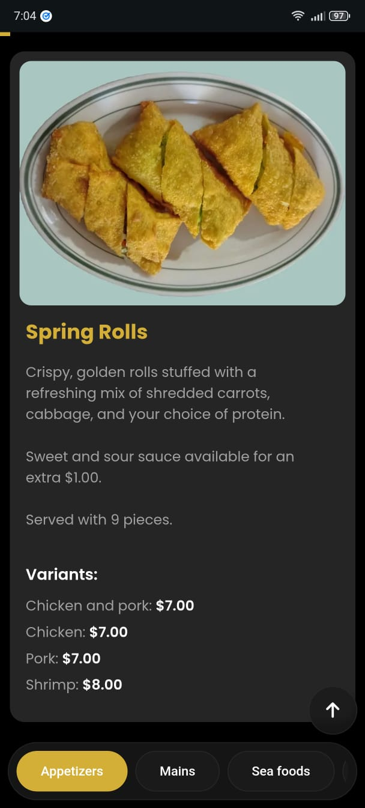

# El Restaurante El Parque 🍽️

<div>
  
  
</div>

A modern and responsive website for **El Restaurante El Parque**, a restaurant offering a rich mix of **Chinese** and **Creole** cuisine.

---

## 📍 About the Project

This website was created to:
- Present the menu and prices for various food categories.
- Promote the unique atmosphere of the restaurant.
- Offer a seamless browsing experience on any device (mobile, tablet, desktop).
- **Includes Dark Mode and Light Mode** support for user preference and better accessibility.

---

## 🛠 Technologies Used

- **HTML5** and **CSS3** for structure and styling
- **JavaScript** for interactivity and menu functionality
- Responsive design using **CSS media queries**
- Dark Mode / Light Mode toggle implemented with CSS variables and JavaScript

---

## 📱 Mobile Friendly

The website adapts to any screen size for an optimal experience across smartphones, tablets, and desktops.

---

## ⚙️ How to Run Locally

1. Clone the repository:
   ```bash
   git clone https://github.com/kelvinhe04/ElRestauranteElParque.git


2. Navigate to the project folder:
   ```bash
   cd ElRestauranteElParque

3. Open `<index.html>` in your browser.


